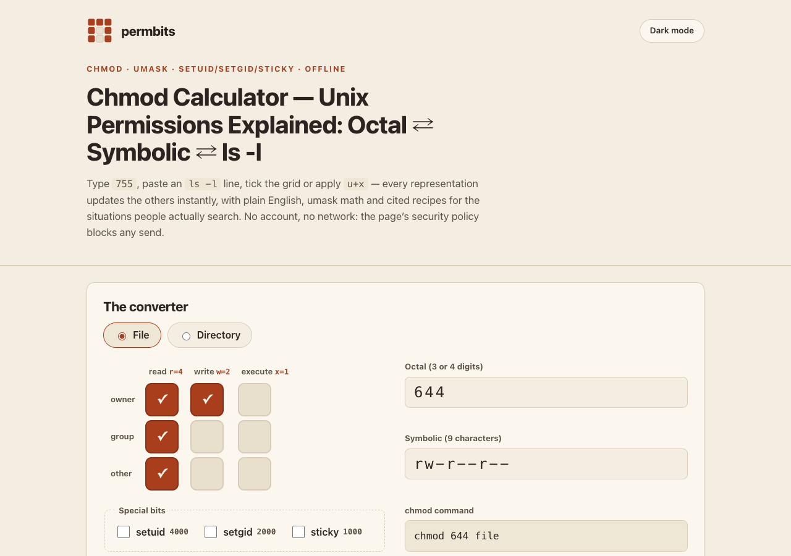

# permbits — chmod in every direction

A chmod calculator that converts classic Unix file permissions **in every direction** —
3/4-digit octal ⇄ 9-character symbolic ⇄ an interactive 3×3 checkbox grid ⇄ a pasted
`ls -l` line — with umask arithmetic, setuid/setgid/sticky bits, plain-English
explanations, risk warnings, and **24 hand-verified recipes** for the situations people
actually search (SSH keys, "UNPROTECTED PRIVATE KEY FILE", web permissions, shared
setgid directories, sudoers…). Every recipe and reference fact carries an upstream
citation and a verified-on date.

**Live:** https://sreenivas-sadhu-prabhakara.github.io/permbits/



## Features

- **Four-way live converter** — edit the octal, the symbolic string, the bit grid or the
  special-bit toggles and every other representation updates instantly, with the exact
  `chmod` command ready to copy. A file/directory switch changes what `x` means.
- **`ls -l` paste parser** — accepts a full line or just the 10/11-char mode field;
  reads the type character (`-` `d` `l` `c` `b` `p` `s`), the `s/S/t/T` special-bit
  letters and the trailing `+` ACL marker (recognised and explained as beyond this tool,
  never silently dropped).
- **Symbolic clause applier** — type `u+x`, `go-w`, `a=rX`, `u=rw,go=` and see
  before → after with the changed slots highlighted. Copy-from-class forms (`u=g`)
  are rejected with a clear message.
- **Umask panel** — enter any umask (one-tap 022/002/077) and see the file
  (`666 & ~umask`) and directory (`777 & ~umask`) arithmetic spelled out.
- **24 cited recipes** — each with the command, a one-line why, the upstream source
  quote, a citation link and a verified-on date, plus a load-into-calculator button
  and client-side search. Distro-variable entries (`/etc/shadow`, `~/.gnupg`) are
  flagged **beta** — load them, then edit the octal to match your system.
- **12 reference facts** — setuid/setgid/sticky on files *and* directories, umask
  arithmetic, directory-execute-means-search, the symbolic grammar including capital
  `X`, the `ls -l` layout, the `+` marker — each with a verbatim quote from POSIX,
  the GNU Coreutils manual or the relevant man page.
- **Printable cheat sheet** — printing the page renders the 24 recipes as a one-page
  reference.
- **Private by construction** — a strict Content-Security-Policy (`connect-src 'none'`)
  means the browser itself blocks any network send. localStorage keeps only your last
  mode and recent recipes.

## Quickstart

No build, no dependencies:

```sh
git clone https://github.com/Sreenivas-Sadhu-Prabhakara/permbits.git
open permbits/index.html        # or serve: python3 -m http.server
```

Run the self-tests (Node 20+):

```sh
cd permbits && node --test
```

The tests re-derive the engine end-to-end: octal⇄symbolic round-trip over all 4096
modes, `s/S/t/T` rendering, `ls -l` parsing fixtures (including `/usr/bin/passwd`
4755 and a setgid+ACL directory), umask arithmetic, symbolic-clause application
(including capital `X` and `u=rw,go=` reset semantics), plus corpus integrity
(12 + 24 items, unique ids, every item cited and dated, octal format invariants)
and add/remove/idempotence property tests.

## Scope — honest limits

- **Classic POSIX mode bits only.** ACLs (beyond recognising the `+` marker),
  SELinux/AppArmor contexts, capabilities and Windows permissions are out of scope.
- **No file access.** permbits cannot read or change real files — it outputs a command
  you run yourself. Verify against your own system.
- **Distros differ.** Recipes cite upstream docs with a verified-on date; packaging can
  differ (e.g. `/etc/shadow`), and such entries are flagged beta with a user override.
- **Everyday symbolic grammar** (`ugoa`, `+-=`, `rwxXst`, comma lists). Copy-from-class
  forms like `u=g` are not parsed in v1. Clauses with no who letter are treated as `a`;
  real chmod additionally masks those with your umask. On directories, `=` follows GNU
  chmod and preserves setuid/setgid unless `s` is mentioned — POSIX leaves this
  implementation-defined, so some systems clear them (use `u-s`/`g-s` to clear explicitly).
- `ls -l` parsing targets POSIX/GNU output; for exotic formats paste just the mode field.
- No `chown`/`chgrp`, no terminal emulation, no accounts, no network.

## Corpus & citations

The 36-item corpus (12 concept facts + 24 recipes) lives in `data/corpus.js` with
per-item provenance: source document, section, URL, verbatim quote and verified-on date
(2026-07-23). Source extracts are staged under `sources/` — see
[`sources/CITATIONS.md`](sources/CITATIONS.md). Two entries could not be verified
against a single authoritative upstream sentence and ship flagged **beta** with the
override path exposed in the UI; nothing in the corpus is invented.

## Privacy

Everything runs in your browser. The page's CSP (`connect-src 'none'`) makes "your
input never leaves this device" enforced by the browser, not merely promised. The only
storage is namespaced localStorage (`permbits:*`) for your last mode, theme and recent
recipes.

## Disclaimer

permbits is an informational reference, not a substitute for your system's
documentation. Permission modes and defaults were verified against the cited sources on
the dates shown; distributions and vendors can change them. Always check `man chmod`
and your distribution's documentation before changing permissions on system files —
a wrong mode on the wrong file can lock you out or open a security hole. This software
is provided "as is", without warranty of any kind; see [LICENSE](LICENSE).

## License

[MIT](LICENSE) © 2026 Sreenivas Sadhu Prabhakara
